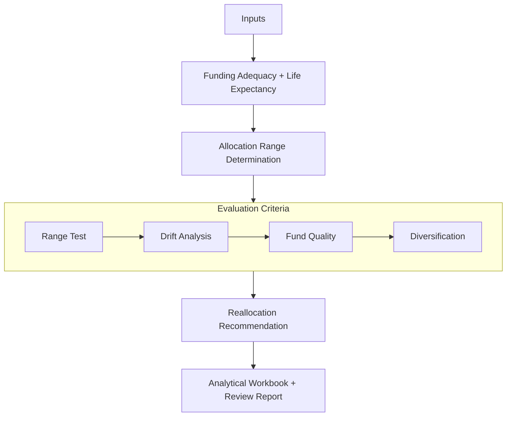

# VUL Subaccount Allocation Review: Analytical Framework and Standard Operating Procedure

**Document Type:** Analytical Framework and Standard Operating Procedure
**Subject:** Variable Universal Life Insurance — Subaccount Allocation Review
**Audience:** Investment Operations Analysts, Trust Officers, Compliance Reviewers
**Status:** Published

---

## 1. Purpose and Scope

This document describes the analytical framework and procedural steps governing subaccount allocation reviews for variable universal life (VUL) insurance policies held in trust. It is intended for analysts and reviewers responsible for evaluating, documenting, and communicating allocation findings in accordance with fiduciary obligations and client investment policy guidelines.

Each review produces a structured finding — supported by both quantitative analysis and narrative documentation — assessing whether a policy's current subaccount allocation is consistent with the applicable client investment model and suitable given the policy's funding status and mortality outlook.

---

## 2. Definitions

| Term | Definition |
|------|------------|
| Funding Adequacy | The projected ability of a policy to sustain coverage to maturity under a standardized earnings assumption. A policy is considered adequately funded if its projected account value supports coverage through the applicable projection period without lapsing. |
| Life Expectancy | An actuarially derived estimate of the expected remaining lifespan of the insured, based on age, gender, and underwriting classification. For survivorship policies, joint life expectancy is applied. |
| Allocation Range | A defined band of equity/fixed income weightings established in the client's investment policy model, representing the appropriate risk exposure for a policy given its funding status and mortality outlook. |
| Asset Class Drift | The deviation of an individual asset class weighting from its target percentage as defined in the client's investment policy model. Drift exceeding a defined tolerance threshold triggers evaluation for reallocation. |
| Diversification | The breadth and balance of asset class representation within a policy's subaccount elections, assessed on a three-tier scale (High, Moderate, Low) based on the number of distinct asset classes represented. |
| Reallocation Recommendation | A documented recommendation to adjust a policy's subaccount elections to bring the allocation into alignment with the applicable investment policy model range and asset class targets. |

---

## 3. Inputs

A complete allocation review requires four primary inputs:

| Input                           | Description                                                                                                                                                                                                                                                            |
| ------------------------------- | ---------------------------------------------------------------------------------------------------------------------------------------------------------------------------------------------------------------------------------------------------------------------- |
| In-Force Illustration           | Projects policy performance at a standardized earnings assumption; used to assess funding adequacy.                                                                                                                                                                    |
| Current Subaccount Data         | A quarterly statement reflecting current subaccount elections, account values, and fund-level details.                                                                                                                                                                 |
| Actuarial Life Expectancy Model | An actuarially derived estimate of insured life expectancy based on age, gender, and underwriting classification.                                                                                                                                                      |
| Fund Analysis Data              | Contains current fund performance history, expense ratios, ratings, and composition data sourced from an industry-standard fund analysis platform (e.g., Morningstar Advisor Workstation); used to evaluate individual subaccount quality and asset class composition. |

All four inputs must be current and reconciled prior to initiating the analytical review.

---

## 4. Analytical Framework

### 4.1 Allocation Range Determination

Each client or trustee maintains an agreed-upon investment policy model consisting of a tiered set of equity/fixed income allocation ranges. The appropriate range for a given policy is determined by evaluating two independent factors:

**Factor 1 — Funding Adequacy**
The in-force illustration is used to assess whether the policy is adequately or inadequately funded. Funding adequacy reflects the policy's projected ability to sustain coverage to maturity under the standardized earnings assumption. Where maturity is not a defined endpoint, adequacy is evaluated against a mortality probability threshold applied with analytical judgment.

**Factor 2 — Life Expectancy**
The actuarial life expectancy estimate characterizes the policy's mortality outlook. For survivorship policies, joint life expectancy is applied.

Together, these two factors establish the applicable allocation range from the client's investment policy model. This range defines the boundaries for the equity/fixed income evaluation that follows.

---

### 4.2 Evaluation Criteria

Once the applicable allocation range is established, the review applies four sequential evaluation criteria.

#### 4.2.1 Equity/Fixed Income Range Test

The current equity/fixed income mix is calculated from the policy's subaccount elections and compared against the applicable range in the client's investment model.

- **Consistent:** Current mix falls within the defined range → proceed to asset class evaluation
- **Inconsistent:** Current mix falls outside the defined range → reallocation is recommended

#### 4.2.2 Asset Class Drift Analysis

Even where the overall equity/fixed income mix is within range, individual asset class allocations are evaluated against the client's target asset class weightings. Asset classes typically evaluated include large cap, mid cap, small cap, domestic fixed income, international equity, and emerging markets, among others, as defined in the client's investment model.

A reallocation recommendation is warranted when any individual asset class deviates from its target weighting by more than a defined tolerance threshold as established in the client's investment policy.

Asset class classifications are verified against fund-level composition data, including underlying equity allocation (domestic/international) and capitalization style (large/mid/small, value/blend/growth), sourced from the fund analysis platform. A fund's stated classification may not fully reflect its underlying holdings; composition review ensures accurate asset class representation in the drift analysis.

#### 4.2.3 Fund Quality Assessment

Each subaccount is evaluated on three fund quality indicators:

| Indicator | Evaluation Criteria |
|-----------|---------------------|
| Performance History | 1-, 3-, and 5-year returns relative to peer funds within the same asset class, sourced from an industry-standard fund analysis platform |
| Expense Ratio | Current expense ratio assessed for reasonableness; upward trends are flagged |
| Fund Rating | Current rating relative to prior periods; sustained rating deterioration is flagged |

Consistent underperformance relative to asset class peers, increasing expenses, or declining fund ratings may independently warrant a reallocation recommendation.

#### 4.2.4 Diversification Assessment

The overall allocation is assessed for diversification quality based on the breadth and balance of asset class representation across subaccounts. Diversification is classified as follows:

| Classification | Criteria |
|----------------|----------|
| High | Six or more distinct asset classes represented |
| Moderate | Three to five distinct asset classes represented |
| Low | Fewer than three distinct asset classes represented |

A **Low** diversification classification independently warrants a reallocation recommendation.

---

### 4.3 Workflow Overview

The following diagram illustrates the end-to-end analytical workflow, from input gathering through output production.

---

## 5. Review Procedure

The following steps constitute the standard allocation review workflow:

1. **Gather and reconcile inputs.**
   - Obtain current in-force illustration
   - Obtain quarterly subaccount statement
   - Obtain actuarial life expectancy estimate
   - Obtain current fund analysis data
   - Confirm all inputs reflect current policy and insured data

2. **Determine applicable allocation range.**
   - Apply the two-factor framework (funding adequacy + life expectancy)
   - Identify the appropriate equity/fixed income range from the client's investment model

3. **Calculate current equity/fixed income mix.**
   - Derive the current allocation mix from subaccount elections and account values

4. **Evaluate allocation against client investment model.**
   - *Equity/fixed income range test:* Compare current mix to the applicable range; document whether the allocation is consistent or inconsistent
   - *Asset class drift analysis:* Evaluate individual asset class weightings against client targets; flag any class exceeding the defined tolerance threshold
   - *Fund quality assessment:* Evaluate each subaccount for performance history, expense ratio, and fund rating; flag subaccounts meeting reallocation criteria
   - *Diversification assessment:* Classify overall allocation as High, Moderate, or Low; flag Low classifications for reallocation

5. **Determine reallocation recommendation.**
   - Based on the results of step 4, determine whether a reallocation is recommended
   - Document the basis for the recommendation

6. **Populate analytical workbook.**
   - Enter current allocation data into the standardized workbook
   - Enter recommended allocation data, if applicable
   - Confirm weighted performance and expense ratio calculations

7. **Complete review report.**
   - Transfer findings and narrative summary into the client-specific report template
   - Apply standard findings notation

8. **Route for review, delivery, and retention.**
   - Submit completed documentation for internal review
   - Deliver findings to trustee or client per established communication protocols
   - Archive for record retention and audit readiness

---

## 6. Output and Documentation Standards

### 6.1 Analytical Workbook

For each reviewed policy, a standardized analytical workbook is completed capturing:

- Fund names and asset class classifications
- Current allocation percentages
- 1-, 3-, and 5-year performance figures
- Expense ratios
- Weighted portfolio performance history (calculated)
- Weighted portfolio expense ratio (calculated)

Where a reallocation is recommended, the workbook also captures the proposed new allocation for side-by-side comparison.

### 6.2 Review Report

Review findings are documented in a client-specific report template containing:

**Cover Page**
- Policy identification and basic policy data
- Current cash value
- Insured information
- Trust information

**Analytical Summary**
- Diversification classification (High / Moderate / Low)
- Allocation consistency finding (Consistent / Inconsistent)
- Narrative bullet summaries of key findings

**Observations**

The report includes brief narrative bullet points addressing:

- Subaccount composition and diversification rationale (e.g., *This policy contains [n] subaccounts representing large cap, mid cap, international, and fixed income asset classes. The allocation is highly diversified.*)
- Consistency finding and supporting basis (e.g., *The allocation is inconsistent with the client's investment model. Based on the insured's life expectancy and current funding status, the policy's allocation falls within the Moderate range; the current equity allocation exceeds the defined upper boundary.*)
- Reallocation recommendation and rationale, where applicable (e.g., *A reallocation is recommended to bring the allocation into alignment with the applicable model range.*)

### 6.3 Findings Notation

To support readability and audit review, standard findings notation is applied consistently across all review reports:

| Finding | Classification | Visual Notation |
|---------|----------------|-----------------|
| Diversification — Adequate | High / Moderate | Green |
| Diversification — Inadequate | Low | Red |
| Allocation — Within Model | Consistent | Green |
| Allocation — Outside Model | Inconsistent | Red |

---

## 7. Exception Handling

Approximately ten percent of reviews involve conditions that require documented exceptions to standard reallocation procedures. Common exception scenarios include:

**Limited Subaccount Availability**
Some policies offer a restricted selection of subaccounts that does not permit complete alignment with the client's target asset class mix. In these cases, the review documents the constraint and assesses the best achievable allocation given available options.

**Rider-Imposed Restrictions**
Certain policy riders limit subaccount availability or impose transfer restrictions. Reviews involving rider constraints document the applicable limitation and its effect on the allocation finding.

**Lapse-Risk Scenarios**
Where a policy is projected to lapse within a near-term horizon, the review may recommend transfer to the fixed account to reduce exposure to market volatility during the remaining policy period. This finding is documented with supporting rationale addressing the funding outlook and the risk mitigation basis for the recommendation.

All exception findings are documented within the standard review report with explicit notation of the exception type and the basis for the alternative recommendation.

---

## 8. AI-Assisted Drafting and Editorial Workflow

This document was developed using a structured, human-in-the-loop drafting workflow incorporating generative AI tools for initial content development, organization, and language refinement.

AI-generated outputs were treated as preliminary drafts and were subject to full editorial review, validation, and revision. All analytical frameworks, procedural steps, and domain-specific interpretations were defined and verified based on subject matter expertise in variable universal life (VUL) policy analysis and fiduciary review practices.

AI was used to improve drafting efficiency and consistency; it was not relied upon as a source of authoritative or domain-specific guidance.

---

## 9. Document Control

| Field         | Value                                               |
| ------------- | --------------------------------------------------- |
| Document Type | Analytical Framework / Standard Operating Procedure |
| Version       | 1.0                                                 |
| Status        | Published                                           |
| Prepared By   | Michael Schwab                                      |
| Date          | 2026-03-30                                          |
| Review Cycle  | Annual or upon material process change              |
